Muscle RNA-seq analysis
================
Dmitry Ryazantsev
2026-01-09

- [1 RNA-seq of muscles](#1-rna-seq-of-muscles)
- [2 PCA plots](#2-pca-plots)
- [3 Differential Expression](#3-differential-expression)
  - [3.1 Compare two ways](#31-compare-two-ways)
    - [3.1.1 Volcano plot and DEGs
      summary](#311-volcano-plot-and-degs-summary)
    - [3.1.2 Boxplots for DEGs](#312-boxplots-for-degs)
    - [3.1.3 Comparison with IMBP precomputed DEG’s
      list](#313-comparison-with-imbp-precomputed-degs-list)
- [4 GO enrichment](#4-go-enrichment)
  - [4.0.1 MF enrich](#401-mf-enrich)
  - [4.0.2 BP enrich](#402-bp-enrich)
  - [4.0.3 CC enrich](#403-cc-enrich)
  - [4.0.4 Other](#404-other)

# 1 RNA-seq of muscles

We use files from SYSTEMS BIOLOGY NII, IMBP, 2nd RNA-seq, ok quality.
(First RNA-seq failed because of EuroMint polymerase usage.) Fastq files
there: `/data7a/bio/human_genomics/muscle/imbp_muscles_generozov/`

During sequencing, the samples were divided into four lanes to avoid
cell fallout. This would result in bias, with rare transcripts
underrepresented and common ones overrepresented. We don’t analyze this
bias. Coverage is OK, and they also include exome and methylation
information. Reads was not trimmed. Fastq read from 4 lanes was
concatenated in 1 total file and quantified by Salmon.

``` r
metadata <- read.csv("/data7a/bio/human_genomics/muscle/imbp_muscles_generozov/meta_imbp_muscles.csv")
tx2gene <- read.csv("/data7a/bio/human_genomics/muscle/analysis/timur_files/itog/tx2gene.csv")
met <- read.csv("/data7a/bio/human_genomics/muscle/analysis/timur_files/itog/samples.csv", stringsAsFactors = F) 
met$Condition <- as.factor(met$Condition)
met$Person <- as.character(met$Person)
rownames(met) <- met$Sample

file_n <- setNames(met$Filepath, met$Sample)
```

Expression matrix

``` r
txi <- tximport(
  file_n,
  type = "salmon",
  tx2gene = tx2gene,
  ignoreTxVersion = TRUE,
  countsFromAbundance = "no")
saveRDS(txi, '/data7a/bio/human_genomics/muscle/analysis/RDS/txi.RDS')
```

Lets check values’ distribution. Попробуем разделить денсити по
образцам. We observe matrix in base state, not in log state.

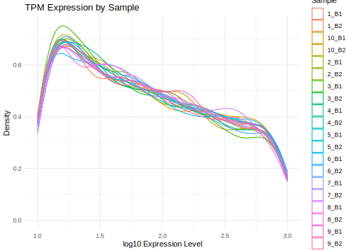<!-- -->

# 2 PCA plots

Lets plot pca to check bias.

``` r
log_pca <- log10(tpm_matrix + 1)
pca <- pca(log_pca, metadata = met, removeVar = 0.1)
```

``` r
screeplot(pca, components = getComponents(pca, seq_len(6)))
```

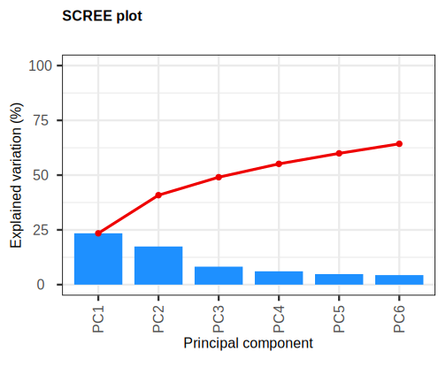<!-- -->

``` r
col_by <- "Condition"
biplot(
  pca, x = "PC1", y = "PC2", pointSize = 3, colby = col_by,
  legendPosition="right", showLoadings = F)
```

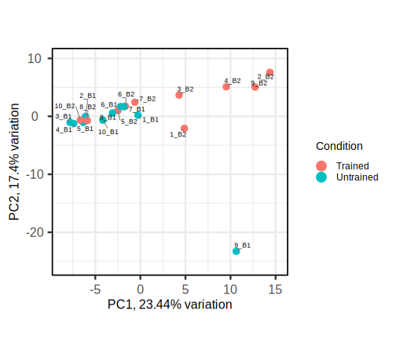<!-- -->

**Findings from PCA:**

1.  There is an artifact sample 9_B1, it needs to be counted with and
    without it.
2.  You can try to identify the tissue of 9_B1.
3.  Points B1 and B2 are divided into groups, but half of the B2 points
    are mixed into the B1 group. This indicates either strong individual
    differences (e.g., different muscle growth rates—this requires
    calibrating the measurement instruments) or a technical error
    (missing the target and taking the wrong tissue, poor rRNA
    depletion, insufficient sample size).

# 3 Differential Expression

Lets count with and without 9B outliers samples.

``` r
dds <- DESeqDataSetFromTximport(
  txi,
  colData = met,
  design = ~ Person + Condition)

keep <- rowSums(counts(dds) >= 10) >= ncol(dds)/2
dds <- dds[keep, ]

dds <- DESeq(dds)
res_all <- results(dds, contrast = c("Condition", "Trained", "Untrained"))

# Фильтрация значимых генов
sig_genes_all <- as.data.frame(res_all)[!is.na(res_all$padj) & res_all$padj < 0.05 & abs(res_all$log2FoldChange) > 1, ]
# add symbols
sig_genes_all$symbol <- mapIds(org.Hs.eg.db, keys = rownames(sig_genes_all),
column = "SYMBOL", keytype = "ENSEMBL", multiVals = "first") 
sig_genes_all <- sig_genes_all[order(sig_genes_all$padj), ]
```

Try without weird sample.

``` r
met_filt <- met[met$Sample != "9_B1", ] 
samples_to_keep <- met_filt$Sample

txi_filt <- txi
txi_filt$counts    <- txi$counts[, samples_to_keep]
txi_filt$abundance <- txi$abundance[, samples_to_keep]
txi_filt$length    <- txi$length[, samples_to_keep]
rm(samples_to_keep)

dds2 <- DESeqDataSetFromTximport(
  txi_filt,
  colData = met_filt,
  design = ~ Person + Condition)
keep <- rowSums(counts(dds2) >= 10) >= ncol(dds2)/2
dds2 <- dds2[keep, ]

dds2 <- DESeq(dds2)
res_nooutl <- results(dds2, contrast = c("Condition", "Trained", "Untrained"))

# Фильтрация значимых генов
sig_genes_nooutl <- as.data.frame(res_nooutl)[!is.na(res_nooutl$padj) & res_nooutl$padj < 0.05 & abs(res_nooutl$log2FoldChange) > 1, ]
# add symbols
sig_genes_nooutl$symbol <- mapIds(org.Hs.eg.db, keys = rownames(sig_genes_nooutl),
column = "SYMBOL", keytype = "ENSEMBL", multiVals = "first") 
sig_genes_nooutl <- sig_genes_nooutl[order(sig_genes_nooutl$padj), ]
write_csv(sig_genes_nooutl, '/data7a/bio/human_genomics/muscle/analysis/download/DEGs_nooutl.csv')
```

Check intersection between outliers filtered and unfiltered.

``` r
v <- list(Filtered = rownames(sig_genes_nooutl), `All samples` = rownames(sig_genes_all))
ggVennDiagram(v) + scale_fill_gradient(low = "#F4FAFE", high = "#4981BF") + coord_flip()
```

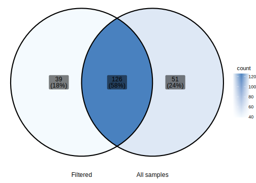<!-- -->

## 3.1 Compare two ways

``` r
print("Without outlier")
```

    ## [1] "Without outlier"

``` r
summary(res_nooutl)
```

    ## 
    ## out of 14528 with nonzero total read count
    ## adjusted p-value < 0.1
    ## LFC > 0 (up)       : 979, 6.7%
    ## LFC < 0 (down)     : 592, 4.1%
    ## outliers [1]       : 0, 0%
    ## low counts [2]     : 0, 0%
    ## (mean count < 7)
    ## [1] see 'cooksCutoff' argument of ?results
    ## [2] see 'independentFiltering' argument of ?results

``` r
print("All samples")
```

    ## [1] "All samples"

``` r
summary(res_all)
```

    ## 
    ## out of 14582 with nonzero total read count
    ## adjusted p-value < 0.1
    ## LFC > 0 (up)       : 868, 6%
    ## LFC < 0 (down)     : 471, 3.2%
    ## outliers [1]       : 0, 0%
    ## low counts [2]     : 0, 0%
    ## (mean count < 7)
    ## [1] see 'cooksCutoff' argument of ?results
    ## [2] see 'independentFiltering' argument of ?results

The DEGs number increased, not decreased. If the outlier carried a
biological signal, there would have been fewer of them. Here, it’s the
opposite—the outlier **smeared the variance**, weakened statistical
power, and obscured the effects between groups.

**MA-plot** — is a diagram in which each point is a gene.

- **A (average expression)** — average gene expression level (log scale)

- **M (minus / fold change)** — logarithm of the expression ratio
  between two conditions (log2FoldChange)

  A = 0.5 \* log2(baseMean) M = log2FoldChange(sample2 / sample1)

``` r
plotMA(res_nooutl, ylim = c(-5, 5), main = "MA-plot Filtered")
```

<!-- -->

``` r
plotMA(res_all, ylim = c(-5, 5), main = "MA-plot Unfiltered")
```

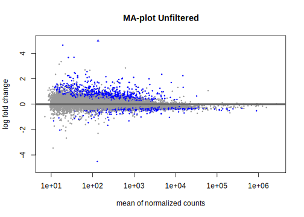<!-- -->

We need to look at the cloud’s displacement to see if the normalization
is correct.

Conclusion from the MA plot: the Filtered values ​​are more closely
clustered, meaning the dispersion has decreased, meaning the outlier was
indeed noisy.

Dispersion estimates for filtered and unfilt.

``` r
plotDispEsts(dds, main = "Dispersion estimates unf")
```

<!-- -->

``` r
plotDispEsts(dds2, main = "Dispersion estimates flt")
```

<!-- -->

Lets check correlation between all FC in all and no_outl groups.

    ## [1] 0.9478473

Correlation is almost the same, no major difference.

### 3.1.1 Volcano plot and DEGs summary

<!-- -->

| n_upregulated | n_downregulated | total_DEGs |
|--------------:|----------------:|-----------:|
|           155 |              10 |        165 |

### 3.1.2 Boxplots for DEGs

### 3.1.3 Comparison with IMBP precomputed DEG’s list

People from the Institute of Medical Problems calculated before us and
gave us a ready-made table with DEGs; we need to compare our results
with it.

``` r
deg_imbp <- read_excel('/data7a/bio/human_genomics/muscle/analysis/upload/imbp_results_DEGs_filtered.xlsx')
sig_genes_imbp <- deg_imbp %>% filter( abs(log2FoldChange) > 1, padj <= 0.05)

v <- list(`My DEGs` = sig_genes_nooutl$symbol, IMBP = sig_genes_imbp$gene_name)
ggVennDiagram(v) + scale_fill_gradient(low = "#F4FAFE", high = "#4981BF") + coord_flip()
```

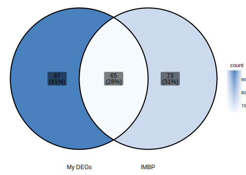<!-- -->

``` r
v <- list(`My DEGs ensg` = rownames(sig_genes_nooutl), IMBP = sig_genes_imbp$gene_id)
ggVennDiagram(v) + scale_fill_gradient(low = "#F4FAFE", high = "#4981BF") + coord_flip()
```

<!-- -->

``` r
v <- list(`My DEGs` = sig_genes_all$symbol, IMBP = sig_genes_imbp$gene_name)
ggVennDiagram(v) + scale_fill_gradient(low = "#F4FAFE", high = "#4981BF") + coord_flip()
```

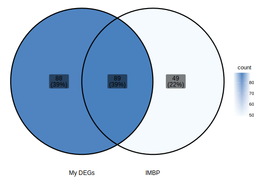<!-- -->

``` r
A <- sig_genes_nooutl$symbol
B <- sig_genes_imbp$gene_name
only_A <- setdiff(A, B)
only_B <- setdiff(B, A)
both_AB <- intersect(A, B)


cat("Only in My DEGs (A):\n", paste(only_A, collapse = ", "), "\n\n")
```

    ## Only in My DEGs (A):
    ##  EDNRB, DOC2B, PTGFRN, COL4A1, LYN, MKI67, PDE10A, NA, HSPA6, VDR, TRAF4, HSPA7, MSR1, FAP, SLC4A3, CHST1, ARHGAP4, COL4A2, TANC2, PNCK, ARMCX2, VSIG4, CASTOR1, KCNJ3, ARL4C, PRKY, LOXHD1, SNCA, MBOAT2, FRMD4A, MYLK, LAD1, PLEKHA4, ADAM28, TAPBP, HTR7, LOXL1, PAG1, FGD2, FERMT3, MYOF, OXER1, PRSS36, DOCK7, TYROBP, NCAPD3, HGF, DOCK10, MMP16, MARCHF1, EPS15, CD48, SERPINE1, NHSL1, OVOS2, LRRC70, ENTPD7, LRRC17, EEF2K, F2RL3, IGSF10, P2RY13, IRF5, HDC, ACTG2, IL10RA, PLD1, CFI, ADGRB2, JAML, POLR2A, GBP5, GALNT5, NSG1, PRXL2B, CLIC1, KCNB1, ARHGAP9, TNFRSF4, TOP2A, FGD3, LOC728488, TDRD6, PRR5L, ADAMTS6, RBBP8, MS4A14, BEND6, APOL5, TBC1D10C, GPR183, GPR173, LOC100129534, PKHD1L1, ITGAM, ILDR2, ACTC1

``` r
cat("Only in IMBP (B):\n", paste(only_B, collapse = ", "), "\n\n")
```

    ## Only in IMBP (B):
    ##  FMO1, ANLN, IGF1, ELN, COL11A1, FCGR2B, SEMA5B, ADAMTS2, MMP2, CFAP61, HEPH, KDELR3, ACP5, SFRP4, OGN, MS4A6A, MS4A4A, TP53I3, PLP1, TNFAIP6, F13A1, EVI2A, TUBA4A, CLEC10A, LOXL2, PCNX2, SLC41A2, AOAH, SLCO1C1, CYP4B1, FCGR2A, CTSK, VASH2, SUSD4, LEFTY2, TMEFF2, MYLK4, LPAR4, PAMR1, MS4A2, KIAA1755, PIEZO2, C1QC, OLFML2B, FSTL1, EDIL3, ESM1, CTHRC1, HTRA1, FBN1, C2, CERCAM, TOP6BL, HSD11B2, SHISA3, FCER1A, FOXS1, UTS2R, TMEM45A, EPHB3, THBS2, MYMK, SAMD11, FAM180B, MPEG1, DPP4, DIO2, MS4A4E, MKRN2OS, AKR1B15, FCGR2C, MILR1, CCL14

``` r
cat("In both lists:\n", paste(both_AB, collapse = ", "), "\n")
```

    ## In both lists:
    ##  PLIN5, CCDC80, MXRA5, S100A4, TRO, CALML6, SPARC, MMP19, FNDC1, COL3A1, LOX, COL6A6, COL5A1, PRND, ASPN, PENK, CPXM1, COL1A1, COL5A2, TPSAB1, MAP1A, MS4A7, THY1, C1QTNF3, FPR3, NEU4, NRK, RNASE6, PLCB2, CPA4, PRG4, BGN, COL1A2, ST8SIA2, TMEM63C, ARHGAP36, MFAP2, DNM1, SH3PXD2B, SFRP2, MEST, TMEM119, SPON1, CAPN6, THBS4, COL14A1, MYL4, AHNAK2, CTSG, MYL5, BASP1, CD1C, CCN3, CD86, CCN4, CD24, PRUNE2, PLPPR4, CPA3, COL8A2, CD163L1, EDA2R, CRISPLD1, POSTN, PTK7

``` r
tibble(
  Group = c("Only in My DEGs", "Only in IMBP", "In both lists", 'IMBP total', 'My DEGs total'),
  Count = c(length(only_A), length(only_B), length(both_AB), length(B), length(A))
) %>% knitr::kable(.) #DT::datatable(caption = "My DEGs vs IMBP comparison")
```

| Group           | Count |
|:----------------|------:|
| Only in My DEGs |    97 |
| Only in IMBP    |    73 |
| In both lists   |    65 |
| IMBP total      |   138 |
| My DEGs total   |   165 |

``` r
rm(A,B, only_A, only_B, both_AB)
```

#### 3.1.3.1 Compare ours and their LFC.

``` r
for_plot <- as.data.frame(res_nooutl)
for_plot$symbol <- mapIds(org.Hs.eg.db, keys = rownames(for_plot),
column = "SYMBOL", keytype = "ENSEMBL", multiVals = "first") 

for_plot <- for_plot %>% left_join(deg_imbp, by=c("symbol"='gene_name')) %>% 
  dplyr::rename(Our_LFC = log2FoldChange.x,
imbp_LFC = log2FoldChange.y)

ggplot(for_plot, aes(x=Our_LFC, y=imbp_LFC)) +
  geom_point()
```

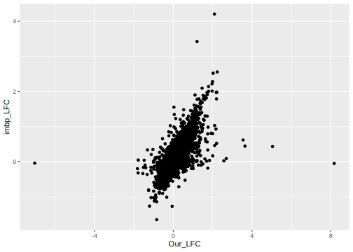<!-- -->

LFC correlate with each other, which proves that we analyzed data in a
similar way.

# 4 GO enrichment

Lets make an enrichment for filtered DEGs.

Before the annotation, lets perform a gene enrichment analysis in Gene
Ontology (GO) separately for three main categories (namespaces):

1.  Molecular Function (MF). Describes the specific biochemical activity
    of a gene product (protein or RNA) at the molecular level. Examples:
    catalytic activity, ion binding, transport activity, DNA binding
    function. Essence: what exactly the molecule can do in a biochemical
    sense.
2.  Biological Process (BP). Characterizes a coordinated series of
    molecular events leading to a result significant for the organism.
    Examples: cell cycle, glucose metabolism, immune response,
    apoptosis, nervous system development. Essence: what integral
    biological phenomenon is ensured by the work of the gene/protein.
3.  Cellular Component (CC). Determines the subcellular localization or
    macromolecular complex where the gene product functions.

pAdjustMethod = “fdr”, pvalueCutoff = 0.01

### 4.0.1 MF enrich

``` r
go_mf <- enrichGO(sig_genes_nooutl$symbol, OrgDb="org.Hs.eg.db", ont="MF", keyType= "SYMBOL", pAdjustMethod = "fdr", pvalueCutoff  = 0.01, qvalueCutoff  = 0.05)
go_mf <- go_mf@result %>% arrange(p.adjust) %>% head(20) 
#DT::datatable(go_mf, caption = "GO MF enrich")
knitr::kable(go_mf)
```

|              | ID           | Description                                                                   | GeneRatio | BgRatio   |    pvalue |  p.adjust |    qvalue | geneID                                                                                                             | Count |
|--------------|:-------------|:------------------------------------------------------------------------------|:----------|:----------|----------:|----------:|----------:|:-------------------------------------------------------------------------------------------------------------------|------:|
| <GO:0005201> | <GO:0005201> | extracellular matrix structural constituent                                   | 18/147    | 166/18496 | 0.0000000 | 0.0000000 | 0.0000000 | MXRA5/SPARC/COL4A1/COL3A1/COL6A6/COL5A1/ASPN/COL1A1/COL5A2/COL4A2/PRG4/BGN/COL1A2/MFAP2/SPON1/COL14A1/COL8A2/POSTN |    18 |
| <GO:0030020> | <GO:0030020> | extracellular matrix structural constituent conferring tensile strength       | 10/147    | 45/18496  | 0.0000000 | 0.0000000 | 0.0000000 | COL4A1/COL3A1/COL6A6/COL5A1/COL1A1/COL5A2/COL4A2/COL1A2/COL14A1/COL8A2                                             |    10 |
| <GO:0005178> | <GO:0005178> | integrin binding                                                              | 12/147    | 154/18496 | 0.0000000 | 0.0000004 | 0.0000003 | COL3A1/LYN/COL5A1/FAP/THY1/FERMT3/SFRP2/THBS4/CCN3/JAML/CCN4/ITGAM                                                 |    12 |
| <GO:0048407> | <GO:0048407> | platelet-derived growth factor binding                                        | 5/147     | 11/18496  | 0.0000000 | 0.0000011 | 0.0000009 | COL4A1/COL3A1/COL5A1/COL1A1/COL1A2                                                                                 |     5 |
| <GO:0002020> | <GO:0002020> | protease binding                                                              | 7/147     | 142/18496 | 0.0001411 | 0.0090015 | 0.0078713 | COL3A1/COL1A1/FAP/COL1A2/SERPINE1/F2RL3/CTSG                                                                       |     7 |
| <GO:0008201> | <GO:0008201> | heparin binding                                                               | 7/147     | 174/18496 | 0.0004876 | 0.0235167 | 0.0205640 | CCDC80/COL5A1/THBS4/CTSG/CCN3/CCN4/POSTN                                                                           |     7 |
| <GO:0030021> | <GO:0030021> | extracellular matrix structural constituent conferring compression resistance | 3/147     | 22/18496  | 0.0006780 | 0.0235167 | 0.0205640 | ASPN/PRG4/BGN                                                                                                      |     3 |
| <GO:0005539> | <GO:0005539> | glycosaminoglycan binding                                                     | 8/147     | 240/18496 | 0.0006780 | 0.0235167 | 0.0205640 | CCDC80/COL5A1/BGN/THBS4/CTSG/CCN3/CCN4/POSTN                                                                       |     8 |
| <GO:0008237> | <GO:0008237> | metallopeptidase activity                                                     | 7/147     | 185/18496 | 0.0007018 | 0.0235167 | 0.0205640 | MMP19/CPXM1/CPA4/ADAM28/MMP16/CPA3/ADAMTS6                                                                         |     7 |
| <GO:0019838> | <GO:0019838> | growth factor binding                                                         | 6/147     | 135/18496 | 0.0007372 | 0.0235167 | 0.0205640 | COL4A1/COL3A1/COL5A1/COL1A1/COL1A2/IL10RA                                                                          |     6 |
| <GO:0008238> | <GO:0008238> | exopeptidase activity                                                         | 5/147     | 102/18496 | 0.0013294 | 0.0385512 | 0.0337108 | CPXM1/FAP/CPA4/MMP16/CPA3                                                                                          |     5 |
| <GO:0051861> | <GO:0051861> | glycolipid binding                                                            | 3/147     | 29/18496  | 0.0015445 | 0.0389132 | 0.0340274 | LYN/THY1/CD1C                                                                                                      |     3 |
| <GO:0005507> | <GO:0005507> | copper ion binding                                                            | 4/147     | 63/18496  | 0.0015858 | 0.0389132 | 0.0340274 | LOX/PRND/SNCA/LOXL1                                                                                                |     4 |
| <GO:0004181> | <GO:0004181> | metallocarboxypeptidase activity                                              | 3/147     | 31/18496  | 0.0018781 | 0.0427941 | 0.0374210 | CPXM1/CPA4/CPA3                                                                                                    |     3 |
| <GO:0008235> | <GO:0008235> | metalloexopeptidase activity                                                  | 4/147     | 68/18496  | 0.0021028 | 0.0447186 | 0.0391039 | CPXM1/CPA4/MMP16/CPA3                                                                                              |     4 |
| <GO:0004252> | <GO:0004252> | serine-type endopeptidase activity                                            | 6/147     | 174/18496 | 0.0026954 | 0.0508071 | 0.0444279 | MMP19/TPSAB1/FAP/PRSS36/CTSG/CFI                                                                                   |     6 |
| <GO:0005031> | <GO:0005031> | tumor necrosis factor receptor activity                                       | 2/147     | 10/18496  | 0.0027076 | 0.0508071 | 0.0444279 | TNFRSF4/EDA2R                                                                                                      |     2 |
| <GO:0001851> | <GO:0001851> | complement component C3b binding                                              | 2/147     | 11/18496  | 0.0032921 | 0.0583426 | 0.0510173 | VSIG4/ITGAM                                                                                                        |     2 |
| <GO:0004175> | <GO:0004175> | endopeptidase activity                                                        | 9/147     | 389/18496 | 0.0039622 | 0.0665232 | 0.0581708 | MMP19/TPSAB1/FAP/ADAM28/PRSS36/MMP16/CTSG/CFI/ADAMTS6                                                              |     9 |
| <GO:0008236> | <GO:0008236> | serine-type peptidase activity                                                | 6/147     | 192/18496 | 0.0043696 | 0.0696954 | 0.0609447 | MMP19/TPSAB1/FAP/PRSS36/CTSG/CFI                                                                                   |     6 |

``` r
write_csv(go_mf, '/data7a/bio/human_genomics/muscle/analysis/download/go_mf.csv')
```

### 4.0.2 BP enrich

``` r
go_bp_a <- enrichGO(sig_genes_nooutl$symbol, OrgDb="org.Hs.eg.db", ont="BP", keyType       = "SYMBOL", pAdjustMethod = "fdr", pvalueCutoff  = 0.01, qvalueCutoff  = 0.05)
go_bp <- go_bp_a@result %>% arrange(p.adjust) %>% head(20)
#DT::datatable(go_bp, caption = "GO BP enrich")
knitr::kable(go_bp)
```

|              | ID           | Description                                                   | GeneRatio | BgRatio   |    pvalue |  p.adjust |    qvalue | geneID                                                                                                                                    | Count |
|--------------|:-------------|:--------------------------------------------------------------|:----------|:----------|----------:|----------:|----------:|:------------------------------------------------------------------------------------------------------------------------------------------|------:|
| <GO:0030198> | <GO:0030198> | extracellular matrix organization                             | 21/153    | 321/18870 | 0.0000000 | 0.0000000 | 0.0000000 | CCDC80/COL4A1/MMP19/COL3A1/LOX/COL5A1/COL1A1/COL5A2/TPSAB1/FAP/COL4A2/LOXL1/COL1A2/MMP16/SH3PXD2B/SFRP2/COL14A1/CTSG/ADAMTS6/COL8A2/POSTN |    21 |
| <GO:0043062> | <GO:0043062> | extracellular structure organization                          | 21/153    | 322/18870 | 0.0000000 | 0.0000000 | 0.0000000 | CCDC80/COL4A1/MMP19/COL3A1/LOX/COL5A1/COL1A1/COL5A2/TPSAB1/FAP/COL4A2/LOXL1/COL1A2/MMP16/SH3PXD2B/SFRP2/COL14A1/CTSG/ADAMTS6/COL8A2/POSTN |    21 |
| <GO:0045229> | <GO:0045229> | external encapsulating structure organization                 | 21/153    | 323/18870 | 0.0000000 | 0.0000000 | 0.0000000 | CCDC80/COL4A1/MMP19/COL3A1/LOX/COL5A1/COL1A1/COL5A2/TPSAB1/FAP/COL4A2/LOXL1/COL1A2/MMP16/SH3PXD2B/SFRP2/COL14A1/CTSG/ADAMTS6/COL8A2/POSTN |    21 |
| <GO:0030199> | <GO:0030199> | collagen fibril organization                                  | 9/153     | 65/18870  | 0.0000000 | 0.0000016 | 0.0000014 | COL3A1/LOX/COL5A1/COL1A1/COL5A2/LOXL1/COL1A2/SFRP2/COL14A1                                                                                |     9 |
| <GO:0043200> | <GO:0043200> | response to amino acid                                        | 8/153     | 126/18870 | 0.0000087 | 0.0035865 | 0.0031745 | COL4A1/COL3A1/LYN/COL1A1/COL5A2/CASTOR1/COL1A2/KCNB1                                                                                      |     8 |
| <GO:0042060> | <GO:0042060> | wound healing                                                 | 14/153    | 423/18870 | 0.0000092 | 0.0035865 | 0.0031745 | COL3A1/LYN/COL5A1/FAP/MYLK/FERMT3/MYOF/SERPINE1/F2RL3/CTSG/JAML/CCN4/CLIC1/PTK7                                                           |    14 |
| <GO:0060348> | <GO:0060348> | bone development                                              | 10/153    | 215/18870 | 0.0000104 | 0.0035865 | 0.0031745 | COL3A1/LOX/COL1A1/BGN/TYROBP/MMP16/SH3PXD2B/LRRC17/TMEM119/CCN4                                                                           |    10 |
| <GO:0001503> | <GO:0001503> | ossification                                                  | 14/153    | 444/18870 | 0.0000159 | 0.0047858 | 0.0042360 | LOX/ASPN/PENK/COL1A1/COL5A2/VDR/COL1A2/HGF/MMP16/SFRP2/TMEM119/IGSF10/CCN4/CLIC1                                                          |    14 |
| <GO:0001101> | <GO:0001101> | response to acid chemical                                     | 8/153     | 141/18870 | 0.0000198 | 0.0053090 | 0.0046991 | COL4A1/COL3A1/LYN/COL1A1/COL5A2/CASTOR1/COL1A2/KCNB1                                                                                      |     8 |
| <GO:0031670> | <GO:0031670> | cellular response to nutrient                                 | 5/153     | 48/18870  | 0.0000424 | 0.0102373 | 0.0090612 | PENK/COL1A1/VDR/PLD1/POSTN                                                                                                                |     5 |
| <GO:0002237> | <GO:0002237> | response to molecule of bacterial origin                      | 12/153    | 369/18870 | 0.0000487 | 0.0106848 | 0.0094573 | EDNRB/LYN/PENK/SNCA/LOXL1/SERPINE1/IRF5/CTSG/IL10RA/CD86/GBP5/CD24                                                                        |    12 |
| <GO:0038063> | <GO:0038063> | collagen-activated tyrosine kinase receptor signaling pathway | 3/153     | 10/18870  | 0.0000602 | 0.0120965 | 0.0107069 | COL4A1/COL1A1/COL4A2                                                                                                                      |     3 |
| <GO:0071230> | <GO:0071230> | cellular response to amino acid stimulus                      | 6/153     | 85/18870  | 0.0000665 | 0.0123359 | 0.0109187 | COL4A1/COL3A1/COL1A1/COL5A2/CASTOR1/COL1A2                                                                                                |     6 |
| <GO:0051250> | <GO:0051250> | negative regulation of lymphocyte activation                  | 8/153     | 169/18870 | 0.0000721 | 0.0124290 | 0.0110011 | LYN/VSIG4/PAG1/TYROBP/CTSG/CD86/TBC1D10C/ILDR2                                                                                            |     8 |
| <GO:0033627> | <GO:0033627> | cell adhesion mediated by integrin                            | 6/153     | 88/18870  | 0.0000807 | 0.0129859 | 0.0114941 | LYN/FERMT3/SERPINE1/SFRP2/CCN3/ITGAM                                                                                                      |     6 |
| <GO:0071295> | <GO:0071295> | cellular response to vitamin                                  | 4/153     | 30/18870  | 0.0000966 | 0.0145731 | 0.0128989 | PENK/COL1A1/VDR/POSTN                                                                                                                     |     4 |
| <GO:0061448> | <GO:0061448> | connective tissue development                                 | 10/153    | 285/18870 | 0.0001135 | 0.0146680 | 0.0129829 | COL3A1/LOX/COL5A1/COL1A1/MBOAT2/BGN/SH3PXD2B/SFRP2/CCN3/CCN4                                                                              |    10 |
| <GO:0006935> | <GO:0006935> | chemotaxis                                                    | 13/153    | 468/18870 | 0.0001165 | 0.0146680 | 0.0129829 | S100A4/EDNRB/LYN/LOX/FPR3/HGF/SERPINE1/THBS4/CTSG/PLD1/CCN3/JAML/GPR183                                                                   |    13 |
| <GO:0071229> | <GO:0071229> | cellular response to acid chemical                            | 6/153     | 94/18870  | 0.0001165 | 0.0146680 | 0.0129829 | COL4A1/COL3A1/COL1A1/COL5A2/CASTOR1/COL1A2                                                                                                |     6 |
| <GO:0042330> | <GO:0042330> | taxis                                                         | 13/153    | 470/18870 | 0.0001216 | 0.0146680 | 0.0129829 | S100A4/EDNRB/LYN/LOX/FPR3/HGF/SERPINE1/THBS4/CTSG/PLD1/CCN3/JAML/GPR183                                                                   |    13 |

``` r
write_csv(go_bp, '/data7a/bio/human_genomics/muscle/analysis/download/go_bp.csv')
```

### 4.0.3 CC enrich

``` r
go_cc <- enrichGO(sig_genes_nooutl$symbol, OrgDb="org.Hs.eg.db", ont="CC", keyType       = "SYMBOL", pAdjustMethod = "fdr", pvalueCutoff  = 0.01, qvalueCutoff  = 0.05)
go_cc <- go_cc@result %>% arrange(p.adjust)%>% head(20)
#DT::datatable(go_cc, caption = "GO CC enrich")
knitr::kable(go_cc)
```

|              | ID           | Description                              | GeneRatio | BgRatio   |    pvalue |  p.adjust |    qvalue | geneID                                                                                                                                                                                     | Count |
|--------------|:-------------|:-----------------------------------------|:----------|:----------|----------:|----------:|----------:|:-------------------------------------------------------------------------------------------------------------------------------------------------------------------------------------------|------:|
| <GO:0062023> | <GO:0062023> | collagen-containing extracellular matrix | 30/154    | 429/19886 | 0.0000000 | 0.0000000 | 0.0000000 | CCDC80/MXRA5/S100A4/SPARC/COL4A1/COL3A1/LOX/COL6A6/COL5A1/ASPN/COL1A1/COL5A2/TPSAB1/COL4A2/PRG4/LAD1/BGN/LOXL1/COL1A2/MFAP2/SERPINE1/SFRP2/SPON1/THBS4/COL14A1/CTSG/CCN3/CPA3/COL8A2/POSTN |    30 |
| <GO:0005581> | <GO:0005581> | collagen trimer                          | 13/154    | 86/19886  | 0.0000000 | 0.0000000 | 0.0000000 | COL4A1/COL3A1/LOX/COL6A6/COL5A1/COL1A1/COL5A2/MSR1/C1QTNF3/COL4A2/COL1A2/COL14A1/COL8A2                                                                                                    |    13 |
| <GO:0098644> | <GO:0098644> | complex of collagen trimers              | 7/154     | 21/19886  | 0.0000000 | 0.0000000 | 0.0000000 | COL4A1/COL3A1/COL5A1/COL1A1/COL5A2/COL4A2/COL1A2                                                                                                                                           |     7 |
| <GO:0005583> | <GO:0005583> | fibrillar collagen trimer                | 5/154     | 12/19886  | 0.0000000 | 0.0000009 | 0.0000008 | COL3A1/COL5A1/COL1A1/COL5A2/COL1A2                                                                                                                                                         |     5 |
| <GO:0098643> | <GO:0098643> | banded collagen fibril                   | 5/154     | 12/19886  | 0.0000000 | 0.0000009 | 0.0000008 | COL3A1/COL5A1/COL1A1/COL5A2/COL1A2                                                                                                                                                         |     5 |
| <GO:0005604> | <GO:0005604> | basement membrane                        | 9/154     | 90/19886  | 0.0000000 | 0.0000013 | 0.0000011 | CCDC80/SPARC/COL4A1/COL5A1/COL4A2/LAD1/LOXL1/THBS4/COL8A2                                                                                                                                  |     9 |
| <GO:0005788> | <GO:0005788> | endoplasmic reticulum lumen              | 11/154    | 313/19886 | 0.0000336 | 0.0011335 | 0.0009707 | COL4A1/COL3A1/COL5A1/PENK/COL1A1/COL5A2/COL4A2/COL1A2/SPON1/COL14A1/COL8A2                                                                                                                 |    11 |
| <GO:0031091> | <GO:0031091> | platelet alpha granule                   | 5/154     | 91/19886  | 0.0007105 | 0.0209586 | 0.0179485 | SPARC/SNCA/FERMT3/HGF/SERPINE1                                                                                                                                                             |     5 |
| <GO:0031093> | <GO:0031093> | platelet alpha granule lumen             | 4/154     | 67/19886  | 0.0018154 | 0.0476030 | 0.0407662 | SPARC/FERMT3/HGF/SERPINE1                                                                                                                                                                  |     4 |
| <GO:0005614> | <GO:0005614> | interstitial matrix                      | 2/154     | 11/19886  | 0.0031303 | 0.0622303 | 0.0532927 | CCDC80/COL14A1                                                                                                                                                                             |     2 |
| <GO:0098981> | <GO:0098981> | cholinergic synapse                      | 2/154     | 11/19886  | 0.0031303 | 0.0622303 | 0.0532927 | PLD1/KCNB1                                                                                                                                                                                 |     2 |
| <GO:0009897> | <GO:0009897> | external side of plasma membrane         | 9/154     | 387/19886 | 0.0032530 | 0.0622303 | 0.0532927 | PRND/SLC4A3/THY1/KCNJ3/CD1C/CD86/TNFRSF4/CD163L1/ITGAM                                                                                                                                     |     9 |
| <GO:0034774> | <GO:0034774> | secretory granule lumen                  | 8/154     | 322/19886 | 0.0036728 | 0.0622303 | 0.0532927 | SPARC/PENK/HSPA6/FERMT3/HGF/SERPINE1/CTSG/ARHGAP9                                                                                                                                          |     8 |
| <GO:0060205> | <GO:0060205> | cytoplasmic vesicle lumen                | 8/154     | 325/19886 | 0.0038832 | 0.0622303 | 0.0532927 | SPARC/PENK/HSPA6/FERMT3/HGF/SERPINE1/CTSG/ARHGAP9                                                                                                                                          |     8 |
| <GO:0031983> | <GO:0031983> | vesicle lumen                            | 8/154     | 326/19886 | 0.0039553 | 0.0622303 | 0.0532927 | SPARC/PENK/HSPA6/FERMT3/HGF/SERPINE1/CTSG/ARHGAP9                                                                                                                                          |     8 |
| <GO:0030027> | <GO:0030027> | lamellipodium                            | 6/154     | 201/19886 | 0.0048280 | 0.0712131 | 0.0609853 | FAP/MYLK/FGD2/ACTG2/FGD3/ACTC1                                                                                                                                                             |     6 |
| <GO:0072562> | <GO:0072562> | blood microparticle                      | 5/154     | 144/19886 | 0.0053022 | 0.0736068 | 0.0630353 | HSPA6/HSPA7/ACTG2/CLIC1/ACTC1                                                                                                                                                              |     5 |
| <GO:0045121> | <GO:0045121> | membrane raft                            | 7/154     | 286/19886 | 0.0069920 | 0.0884566 | 0.0757523 | LYN/THY1/PAG1/MYOF/CD48/CD24/ITGAM                                                                                                                                                         |     7 |
| <GO:0098857> | <GO:0098857> | membrane microdomain                     | 7/154     | 287/19886 | 0.0071215 | 0.0884566 | 0.0757523 | LYN/THY1/PAG1/MYOF/CD48/CD24/ITGAM                                                                                                                                                         |     7 |
| <GO:0031092> | <GO:0031092> | platelet alpha granule membrane          | 2/154     | 17/19886  | 0.0075082 | 0.0885967 | 0.0758723 | SPARC/SNCA                                                                                                                                                                                 |     2 |

``` r
write_csv(go_cc, '/data7a/bio/human_genomics/muscle/analysis/download/go_cc.csv')
```

### 4.0.4 Other

#### 4.0.4.1 cnetplot bp

``` r
barplot(go_bp_a, showCategory = 20) + ggtitle("GO enrichment filtered")
```

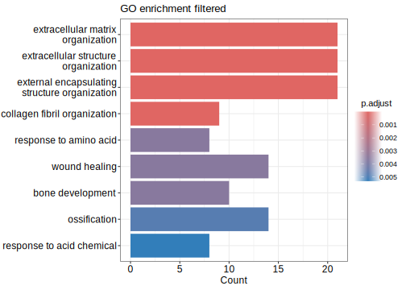<!-- -->

``` r
#cnetplot(go, foldChange = NULL)
cnetplot(go_bp_a, foldChange = sig_genes_nooutl$log2FoldChange)
```

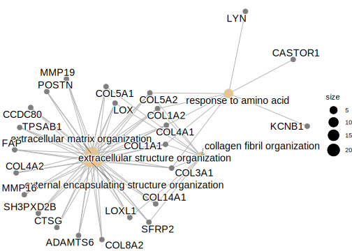<!-- -->

#### 4.0.4.2 **compare GO: All samples vs No outliers.**

``` r
genes_list <- list(
  NoOutlier = sig_genes_nooutl$symbol,
  AllSamples = sig_genes_all$symbol
)
cc <- compareCluster(
  geneClusters = genes_list,
  fun = "enrichGO",
  OrgDb = org.Hs.eg.db,
  ont = "BP",
  keyType = "SYMBOL",
  pvalueCutoff = 0.01,
  qvalueCutoff = 0.05,
  pAdjustMethod = "BH"
)
dotplot(cc, showCategory = 20) + 
  ggtitle("GO NoOutlier vs AllSamples")
```

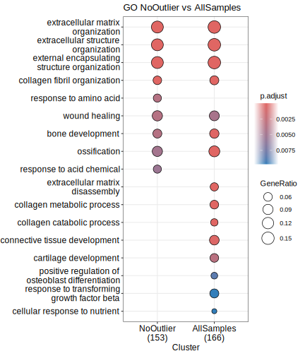<!-- -->

``` r
as.data.frame(cc) %>% arrange(p.adjust) %>% head(20) %>% knitr::kable(.) #DT::datatable()
```

| Cluster    | ID           | Description                                   | GeneRatio | BgRatio   |   pvalue |  p.adjust |    qvalue | geneID                                                                                                                                                                   | Count |
|:-----------|:-------------|:----------------------------------------------|:----------|:----------|---------:|----------:|----------:|:-------------------------------------------------------------------------------------------------------------------------------------------------------------------------|------:|
| AllSamples | <GO:0030198> | extracellular matrix organization             | 26/166    | 321/18870 | 0.00e+00 | 0.0000000 | 0.0000000 | CCDC80/LOX/COL3A1/TPSAB1/MMP19/COL1A1/FAP/COL5A2/COL5A1/LOXL1/MMP2/DPP4/MMP16/SH3PXD2B/SFRP2/COL1A2/OLFML2B/CTSK/CTSG/COL8A2/ADAMTS6/ADAMTS14/POSTN/COL14A1/MMP11/COL9A1 |    26 |
| AllSamples | <GO:0043062> | extracellular structure organization          | 26/166    | 322/18870 | 0.00e+00 | 0.0000000 | 0.0000000 | CCDC80/LOX/COL3A1/TPSAB1/MMP19/COL1A1/FAP/COL5A2/COL5A1/LOXL1/MMP2/DPP4/MMP16/SH3PXD2B/SFRP2/COL1A2/OLFML2B/CTSK/CTSG/COL8A2/ADAMTS6/ADAMTS14/POSTN/COL14A1/MMP11/COL9A1 |    26 |
| AllSamples | <GO:0045229> | external encapsulating structure organization | 26/166    | 323/18870 | 0.00e+00 | 0.0000000 | 0.0000000 | CCDC80/LOX/COL3A1/TPSAB1/MMP19/COL1A1/FAP/COL5A2/COL5A1/LOXL1/MMP2/DPP4/MMP16/SH3PXD2B/SFRP2/COL1A2/OLFML2B/CTSK/CTSG/COL8A2/ADAMTS6/ADAMTS14/POSTN/COL14A1/MMP11/COL9A1 |    26 |
| NoOutlier  | <GO:0030198> | extracellular matrix organization             | 21/153    | 321/18870 | 0.00e+00 | 0.0000000 | 0.0000000 | CCDC80/COL4A1/MMP19/COL3A1/LOX/COL5A1/COL1A1/COL5A2/TPSAB1/FAP/COL4A2/LOXL1/COL1A2/MMP16/SH3PXD2B/SFRP2/COL14A1/CTSG/ADAMTS6/COL8A2/POSTN                                |    21 |
| NoOutlier  | <GO:0043062> | extracellular structure organization          | 21/153    | 322/18870 | 0.00e+00 | 0.0000000 | 0.0000000 | CCDC80/COL4A1/MMP19/COL3A1/LOX/COL5A1/COL1A1/COL5A2/TPSAB1/FAP/COL4A2/LOXL1/COL1A2/MMP16/SH3PXD2B/SFRP2/COL14A1/CTSG/ADAMTS6/COL8A2/POSTN                                |    21 |
| NoOutlier  | <GO:0045229> | external encapsulating structure organization | 21/153    | 323/18870 | 0.00e+00 | 0.0000000 | 0.0000000 | CCDC80/COL4A1/MMP19/COL3A1/LOX/COL5A1/COL1A1/COL5A2/TPSAB1/FAP/COL4A2/LOXL1/COL1A2/MMP16/SH3PXD2B/SFRP2/COL14A1/CTSG/ADAMTS6/COL8A2/POSTN                                |    21 |
| AllSamples | <GO:0030199> | collagen fibril organization                  | 11/166    | 65/18870  | 0.00e+00 | 0.0000000 | 0.0000000 | LOX/COL3A1/COL1A1/COL5A2/COL5A1/LOXL1/SFRP2/COL1A2/ADAMTS14/COL14A1/MMP11                                                                                                |    11 |
| NoOutlier  | <GO:0030199> | collagen fibril organization                  | 9/153     | 65/18870  | 0.00e+00 | 0.0000016 | 0.0000014 | COL3A1/LOX/COL5A1/COL1A1/COL5A2/LOXL1/COL1A2/SFRP2/COL14A1                                                                                                               |     9 |
| AllSamples | <GO:0022617> | extracellular matrix disassembly              | 9/166     | 62/18870  | 0.00e+00 | 0.0000016 | 0.0000015 | TPSAB1/MMP19/FAP/MMP2/DPP4/SH3PXD2B/CTSK/CTSG/MMP11                                                                                                                      |     9 |
| AllSamples | <GO:0032963> | collagen metabolic process                    | 10/166    | 106/18870 | 0.00e+00 | 0.0000126 | 0.0000115 | MMP19/COL1A1/FAP/COL5A1/MMP2/MMP16/COL1A2/CTSK/ADAMTS14/MMP11                                                                                                            |    10 |
| AllSamples | <GO:0001503> | ossification                                  | 18/166    | 444/18870 | 1.00e-07 | 0.0000259 | 0.0000235 | LOX/PENK/COL1A1/COL5A2/CTHRC1/MMP2/HGF/VDR/MMP16/TMEM119/IGSF10/SHOX2/SFRP2/ASPN/COL1A2/CTSK/CLIC1/CCN4                                                                  |    18 |
| AllSamples | <GO:0030574> | collagen catabolic process                    | 7/166     | 45/18870  | 1.00e-07 | 0.0000357 | 0.0000325 | MMP19/FAP/MMP2/MMP16/CTSK/ADAMTS14/MMP11                                                                                                                                 |     7 |
| AllSamples | <GO:0060348> | bone development                              | 12/166    | 215/18870 | 5.00e-07 | 0.0001187 | 0.0001079 | LOX/COL3A1/COL1A1/FBN1/BGN/MMP16/TMEM119/SH3PXD2B/SHOX2/LRRC17/CCN4/SFRP4                                                                                                |    12 |
| AllSamples | <GO:0061448> | connective tissue development                 | 13/166    | 285/18870 | 1.50e-06 | 0.0003457 | 0.0003141 | LOX/COL3A1/COL1A1/MBOAT2/COL5A1/BGN/SH3PXD2B/SHOX2/SFRP2/CCN3/CTSK/SNORC/CCN4                                                                                            |    13 |
| AllSamples | <GO:0051216> | cartilage development                         | 10/166    | 207/18870 | 1.53e-05 | 0.0032253 | 0.0029303 | COL3A1/COL1A1/MBOAT2/BGN/SHOX2/SFRP2/CCN3/CTSK/SNORC/CCN4                                                                                                                |    10 |
| NoOutlier  | <GO:0043200> | response to amino acid                        | 8/153     | 126/18870 | 8.70e-06 | 0.0035865 | 0.0031745 | COL4A1/COL3A1/LYN/COL1A1/COL5A2/CASTOR1/COL1A2/KCNB1                                                                                                                     |     8 |
| NoOutlier  | <GO:0042060> | wound healing                                 | 14/153    | 423/18870 | 9.20e-06 | 0.0035865 | 0.0031745 | COL3A1/LYN/COL5A1/FAP/MYLK/FERMT3/MYOF/SERPINE1/F2RL3/CTSG/JAML/CCN4/CLIC1/PTK7                                                                                          |    14 |
| NoOutlier  | <GO:0060348> | bone development                              | 10/153    | 215/18870 | 1.04e-05 | 0.0035865 | 0.0031745 | COL3A1/LOX/COL1A1/BGN/TYROBP/MMP16/SH3PXD2B/LRRC17/TMEM119/CCN4                                                                                                          |    10 |
| AllSamples | <GO:0042060> | wound healing                                 | 14/166    | 423/18870 | 2.33e-05 | 0.0045121 | 0.0040994 | COL3A1/FAP/COL5A1/MYOF/MYLK/JAML/CTSG/CLIC1/PTK7/F13A1/TMEFF2/F2RL3/CCN4/FERMT3                                                                                          |    14 |
| NoOutlier  | <GO:0001503> | ossification                                  | 14/153    | 444/18870 | 1.59e-05 | 0.0047858 | 0.0042360 | LOX/ASPN/PENK/COL1A1/COL5A2/VDR/COL1A2/HGF/MMP16/SFRP2/TMEM119/IGSF10/CCN4/CLIC1                                                                                         |    14 |
